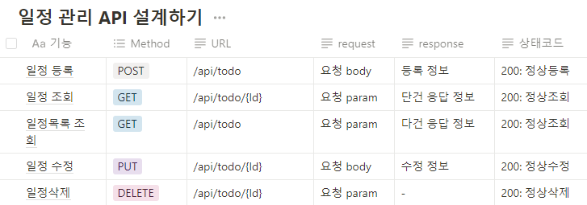
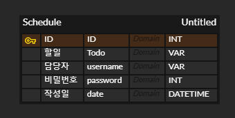

# 주특기 입문 주차 개인과제
### 📖 Goal:  "나만의 일정 관리 앱 서버 만들기"
**학습 과제를 끝내고 나면 해낼 수 있어요!** 👍
1. 구현하고자 하는 서비스의 전체적인 흐름을 파악하고 필요한 기능을 설계할 수 있습니다.
2. API 명세서, ERD, SQL을 작성할 수 있습니다.
3. Spring Boot를 기반으로 CRUD(Create, Read, Update, Delete) 기능이 포함된 REST API를 만들 수 있습니다.

##

-  기능 설계
    1. 접속 하자마자 할일 전체 목록 조회하기
        1. GET API 사용해서 할일 목록 불러오기
    2. 할일 생성하기
        1. POST API 사용해서 할일 신규 생성하기
        2. 생성된 할일 반환
    3. 할일 변경하기
        1. PUT API 사용해서 할일 내용 변경하기
        2. 사용자가 클릭한 할일이 DB에 존재하는지 확인하기
        3. 해당 내용 변경
    4. 할일 삭제하기
        1. DELETE API 사용해서 할일 삭제하기
        2. 사용자가 삭제하려는 할일이 DB에 존재하는지 확인하기
        3. DB에서 해당 내용 삭제

##
### API 

### ERD 작성
